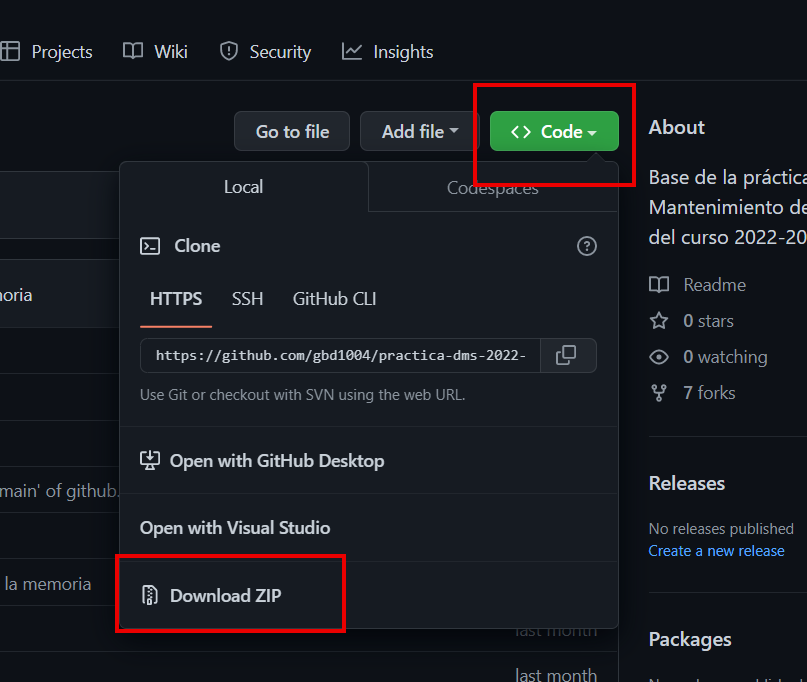

# **MANUAL DE USUARIO**
En el presente documento el usuario podrá encontrar un manual sobre la utilización de la API REST realizada en la práctica 01 de la asignatura de Diseño y Mantenimiento de Software.

## Autores
Los autores de este manual de usuario son los listados a continuación:
* Guillermo Arcal García (gag1005@alu.ubu.es)
* Gonzalo Burgos de la Hera (gbd1004@alu.ubu.es)
* Santiago Díaz Gómez-Guillamón (sdg1002@alu.ubu.es)
* Gadea Lucas  Pérez (glp1002@alu.ubu.es)

## Tabla de contenido
[ ] TO DO

## API REST Práctica 01 (DMSW)
### Descarga e instalación
Todo el código necesario para utilizar la API se encuentra en el repositorio ubicado en https://github.com/gbd1004/practica-dms-2022-2023/tree/main. Bastará con descargar este código en la máquina deseada haciendo clic sobre el botón "código" (ver _ilustración 1_) o escribiendo en línea de comando la siguiente orden (en el directorio donde se desee descargarlo):
```
$ git clone https://github.com/gbd1004/practica-dms-2022-2023.git
```


A continuación, será necesario proceder con la instalación de Docker, que nos permitirá iniciar y detener la aplicación en cualquier momento. Para ello, bastará con descargar la versión adecuada en la página oficial (i.e. https://www.docker.com/#) o directamente haciendo uso de la herramienta de intalación de paquetes de la distribución del usuario.

### Ejecución

Para la ejecución de la API, será necesario utilizar la herramienta Docker instalada. Si es la primera vez que el usuario ejecuta la API, será preciso construir las imágenes del contenedor.
```
$ docker-compose -f docker/config/dev.yml build
```
[ ]TO DO

### Explotación de la API


## BIBLIOGRAFÍA

title: "Capas, cebollas y colmenas: arquitecturas en el backend."
author: "Cabrera, A.A."
date: "2019"
link: https://www.adictosaltrabajo.com/2019/07/02/capas-cebollas-y-colmenas-arquitecturas-en-el-backend/


