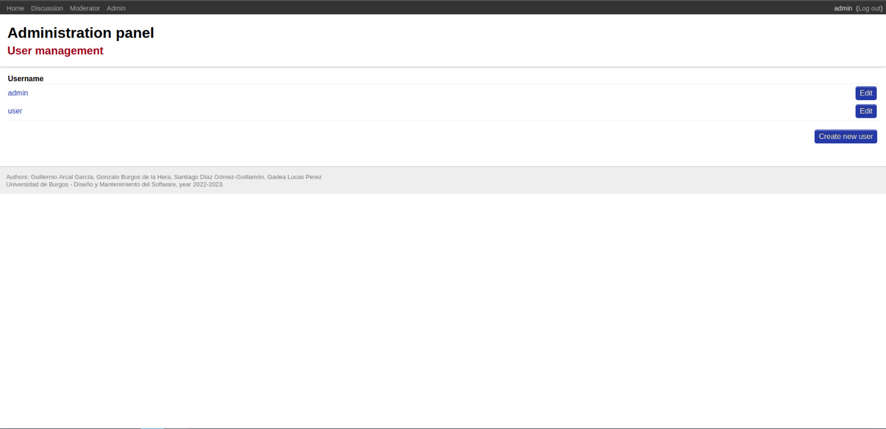

# **MANUAL DE USUARIO**
En el presente documento el usuario podrá encontrar un manual sobre la utilización de la API REST realizada en la práctica 01 de la asignatura de Diseño y Mantenimiento de Software.

## Autores
Los autores de este manual de usuario son los listados a continuación:
* Guillermo Arcal García (gag1005@alu.ubu.es)
* Gonzalo Burgos de la Hera (gbd1004@alu.ubu.es)
* Santiago Díaz Gómez-Guillamón (sdg1002@alu.ubu.es)
* Gadea Lucas  Pérez (glp1002@alu.ubu.es)

## Tabla de contenido
[ ] TO DO

## API REST Práctica 01 (DMSW)
## Descarga e instalación
Todo el código necesario para utilizar la API se encuentra en el repositorio ubicado en https://github.com/gbd1004/practica-dms-2022-2023/tree/main. Bastará con descargar este código en la máquina deseada haciendo clic sobre el botón "código" (ver _ilustración 1_) o escribiendo en línea de comando la siguiente orden (en el directorio donde se desee descargarlo):
```
$ git clone https://github.com/gbd1004/practica-dms-2022-2023.git
```


A continuación, será necesario proceder con la instalación de Docker, que nos permitirá iniciar y detener la aplicación en cualquier momento. Para ello, bastará con descargar la versión adecuada en la página oficial (i.e. https://www.docker.com/#) o directamente haciendo uso de la herramienta de intalación de paquetes de la distribución del usuario.

## Ejecución

Para la ejecución de la API, será necesario utilizar la herramienta Docker instalada. Si es la primera vez que el usuario ejecuta la API, será preciso construir las imágenes del contenedor.
Puede iniciarse el Docker usando los scripsts startDockers.sh desde la carpeta del repositorio, o con el comando:
```
$ docker-compose -f docker/config/dev.yml build
```

## Contenido y Funciones de la Página
### 1. Introducción y Consideraciones

Esta es una página web orientada como un foro. La principal funcionalidad de la misma es la de soportar las acciones asociadas a un foro, tales como crear preguntas, respuestas a estas preguntas y comentarios sobre las respuestas.

La página incluye todas las funcionalidades necesarias para crear y gestionar este tipo de comunidad,
y dichas acciones vienen asociadas a los tres posibles roles que puede tener un usuario, explicaremos en mayor detalle estos roles a continuación.

### 2. Roles y Funciones
Cada usuario de la página tiene asignado uno o varios roles, lo que le permiten realizar diferentes acciones dentro del dominio. Estos tres roles son _discusion, __moderacion_ y _administrador_.

#### 2.1. Discusión
Discusión es el rol más común, esta orientado al usuario promedio de la página, y permite la interacción con la página es mediante la creación  votación o reporte de preguntas, comentarios y respuestas.

Las acciones básicas que podría realizar un usuario con el rol de _discusión_ son:

+ Ver el listado de preguntas 
+ Visionado de preguntas individuales con respuestas, comentarios y votos
+ Creación de preguntas 
* Creación de respuestas a preguntas 
+ Creación de comentarios a respuestas 
+ Votar respuestas
+ Votar comentarios 
+ Reportar preguntas 
+ Reportar respuestas 
+ Reportar comentarios 

#### 2.2. Moderación
Aquellos con el rol de Moderador son los encargados de asegurar que se cumplan las directivas de contenido de la página, para ello pueden acceder a menú con los reportes realizados por los usuarios, y desde allí, decidir si aplicar el reporte, o rechazarlo con dos botones.

Los reportes rechazados dejarán de serle visibles al resto de usuarios. La acción de moderar solo puede ser realizada por los que posean este rol.

Las acciones básicas que podría realizar un usuario con el rol de _moderador_ son:

+ Visionado de preguntas individuales con respuestas, comentarios y votos 
+ Ver listados de reportes
+ Resolver reportes 
+ Ocultar preguntas/respuestas/comentarios al aceptar reportes

#### 2.3. Administrador
El rol de administrador está pensado para poder realizar acciones orientadas a la gestión de usuarios, tales como la creación o el borrado de usuarios, y la asignación de roles.

Las acciones básicas que podría realizar un usuario con el rol de _administrador_ son:

+ Creación de usuarios nuevos
+ Eliminación de usuarios existentes
+ Asignación de roles


### 3. Páginas

#### 3.1. Inicio de Sesión
La primera página a la que tenemos acceso no es otra que la página de inicio de sesión, en la cuál podremos poner nuestras credenciales para acceder al resto de menús


#### 3.2. Página Principal Home
Página a la que accederemos tras iniciar sesión. Las partes de esta página son:

##### Barra Superior
Esta es la parte con el contenido principal de la página, ya que en ella se encuentra el acceso al resto de submenús correspondientes a cada rol (Discusión, Moderación y Administrador), junto con un botón de retorno
Esta barra aparecerá en todas las páginas del dominio.

##### Zona Central
En la zona central simplemente aparece un mensaje de bienvenida al usuario que cambia en función de su rol

##### Zona Inferior
En la zona inferior aparecen datos sobre los autores junto con la institución de pertenencia

#### 3.3. Menú de Discusiones
Desde aquí los usuarios con el rol de discusión pueden visualizar el contenido del foro y realizar las acciones asociadas a su rol, los elementos de esta página son:


+ Lista de Preguntas: Esta ocupa la parte central del sitio y muestra todas las preguntas creadas por los usuarios
+ Botón "Ver Respuestas": Permite acceder a otra página en la que se mostrarán las respuestas a la pregunta junto con los comentarios y respuestas.
Se explica en detalle en el apartado "Página de Answers"
+ Botón "Añadir Pregunta": Se nos muestra un submenú en el que deberemos añadir el título y cuerpo de la pregunta que queramos crear junto con un botón para confirmar nuestra acción "Añadir pregunta"

+ Botón "Repotar": Menú simple para realizar un reporte sobre algún elemento que incumpla las directrices del sitio, se debe indicar la razón del reporte y confirmar el envío con el botón "Añadir reporte"


###### Página de Answers
En esta página, el usuario puede visualizar la pregunta a la que ha accedido, junto con las respuestas a la misma y sus comentarios en formato anidado.


+ Botón "Añadir Respuesta": Sirve para añadir una respuesta a la pregunta, debe incluir nombre y cuerpo.

+ Botón "Añadir Comentario": Funcionalidad muy similar a añadir respuesta, solo que con comentarios

+ Botón "Votar": Sirve para expresar acuerdo o aprobación con el contenido de las respuestas y los comentarios, una vez que un usuario da su voto, este no puede quitarse y aparecerá el número de votos junto al botón
+ Botón "Reportar": Tiene la misma funcionalidad ya explicada en el menú de discusiones

##### 3.4. Menú de Moderador
En el menú de moderador aparecerá una lista mostrando los elementos que hayan recibido reportes junto con dos botones de acción:

+ Aceptar Reporte: Oculta este elemento para el resto de usuarios y lo hace inaccesible
+ Rechazar Reporte: Elimina el elemento de la lista de 

##### 3.5. Menú de Administrador
En este menú la única opción disponible es el acceso a la gestión de usuarios "User managment", dentro del cuál se nos presentan más opciones.


###### Panel de Administración
Página desde la que se pueden realizar las operaciones de gestión del administrador como tal. Los elementos que tiene son:

+ Lista de Usuarios: Una lista con todos los usuarios registrados en la página
+ Botón "Edit": Desde este botón se accede a un submenú para la gestión de los roles del usuario en cuestión


