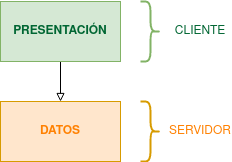
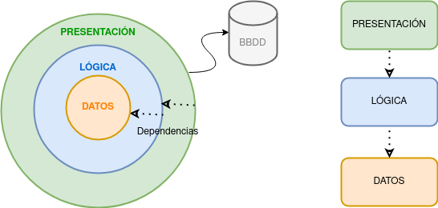
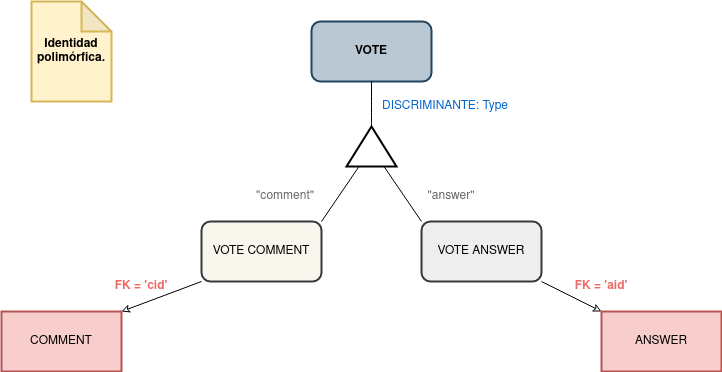
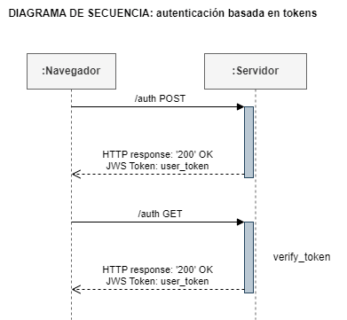

# **PRÁCTICA 01**

___


<br/>
<br/>

En el presente documento se redactará el informe sobre la práctica 01 de la asignatura de Diseño y mantenimiento del software.

## **Alumnos**

El grupo de alumnos que realizará la práctica está compuesto por:
* Guillermo Arcal García (gag1005@alu.ubu.es)
* Gonzalo Burgos de la Hera (gbd1004@alu.ubu.es)
* Santiago Díaz Gómez-Guillamón (sdg1002@alu.ubu.es)
* Gadea Lucas  Pérez (glp1002@alu.ubu.es)

## **Tabla de contenido**

- [**Diseño Frontend**](#diseño-frontend)
  - [**Arquitectura de dos niveles (Documento-Vista)**](#arquitectura-de-dos-nivelesdocumento-vista)
- [**Diseño Backend**](#diseño-backend)
  - [**Arquitectura de tres capas**](#arquitectura-de-tres-capas)
- [**Sobre Auth**](#sobre-auth)
- [**Decisiones de diseño**](#decisiones-de-diseño)
  - [***Patrón fachada***](#patrón-fachada)
  - [***Aspecto reports***](#aspecto-reports)
  - [***Votos***](#votos)
- [**De cara al futuro**](#de-cara-al-futuro)
- [**BIBLIOGRAFÍA**](#bibliografía)
  
## **Repositorio**

El _fork_ del repoositorio usado por los alumnos es el siguiente:  https://github.com/gbd1004/practica-dms-2022-2023.


<br/>
<br/>

---
___

<br/>
<br/>
<!-- # Memoria -->
<h1 style="border-bottom: none">
    <b>Memoria</b>
</h1>

A continuación se explicarán las decisiones de diseño tomadas a lo largo de la práctica con su justificación correspondiente.


##  **Diseño Frontend**
En el _frontend_ se pueden distinguir las siguientes capas:
1.  <ins>Capa de presentación:</ins> En esta capa se implementan los métodos que hacen llamadas a las fachadas (_web controllers_).
2. <ins>Capa de datos:</ins> En esta capa se hace llamada al ```backendservice``` (del que se hablará más adelante) y el ```authservice```, que funcionan a modo de fachadas para poder acceder a los subsistemas que poseen los datos de la API.

Por otro lado, en el _frontend_ también se encuentran los archivos HTML y el resto de programación web que conformará el aspecto de la página.


###  **Arquitectura de dos niveles (Documento-Vista)**

Una de las arquitecturas más tradicionales es la de dos capas, i.e.: [Cliente, servidor]. Como se ha mencionado ya, nuestro _frontend_ posee dos capas diferenciadas, por un lado, una capa a nivel de presentación y, por otro, una capa a nivel de datos. La lógica del _frontend_ está repartida entre el nivel de datos y el de presentación.




Para futuras modificaciones, se propone reutilizar el código de los ficheros HTML de _macros_. Para poder extender más fácilmente el código (principio SOLID __Open/Closed__) se haría uso del polimorfismo (herencia). Así pues, se crearía un fichero ```lists.html``` que funcionaría como una interfaz común de la que heredarían los subelementos ```list_questions.html```, ```list_answer.html```, ```list_comments.html```, etc... Se deberá tener en cuenta el principio ___Liskov's substitution___ de forma que se pueda sustituir una instancia de ```lists.html``` por una instancia de uno de los subelementos sin modificar el comportamiento del programa. De esta forma lograríamos reducir el fuerte acoplamiento actual y garantizaríamos que todas estas listas estén abiertas a su extensión (pero no a su modificación).


## **Diseño Backend**
Aunque por lo general el _backend_ suele tener tres capas (i.e.: servicio, negocio y datos), en ocasiones se incluye una capa superior de presentación, como se ha hecho en este caso. La razón de esta decisión recae en la naturaleza de la aplicación, i.e. una API REST. Así pues, en esta capa se incluyen los controladores REST. Por otro lado, puesto que no se hace uso de la capa de servicios, finalmente, nos decidimos por una arquitectura de tres capas: [Presentación, Lógica, Datos]. 

Así pues en la capa de _backend_ se pueden distinguir las siguientes capas:

1. <ins>Capa de datos:</ins> En esta capa se implementa la BBDD local que soporta la API. Sin embargo, no se hace directamente a través de _scripts_ SQL, sino a trés de un ORM. En este caso, se ha hecho uso de SQLAlchemy, que permite, a través de código escrito en Python, mapear y relacionar objetos de la "BBDD". Otro detalle importante es la división de los resultados: _results_ y _resultsets_. En el primer módulo se encuentra la definición de las tablas y la representación de cada objeto. En el segundo módulo se encuentran aquellas sentencias SELECT que devuelven listas de registros, los crean o modifican.
2. <ins>Capa de lógica:</ins> En esta capa se determina el manejo específico que la aplicación hace con los datos. En este nivel se procesa la información recopilada en el nivel de presentación contra otra información de la capa de datos (en el proceso, se añaden y modifican los registros).
3. <ins>Capa de presentación:</ins> En la capa de presentación se encuentran aquellos métodos enfocados a que las acciones de los usuarios interactuen con el backend. Estos métodos se ejecutan en el servidor. En este caso, respetando las directivas del fichero ```spec.yml```, se da formato JSON a los datos obtenidos de la BBDD a través de la capa de lógica. De esta forma, el _frontend_ podrá manejar los datos de las respuestas de los métodos REST fácilmente (i.e.: diccionarios). Adicionalmente se devuelve también el código de respuesta HTTP.


### **Arquitectura de tres capas**
 En este caso, se usará una arquitectura multicapa (i.e. se separan los componentes en distintas capas físicas). Estas capas están formadas por distintos subsistemas y están organizadas jerárquicamente siguiendo una dependencia siempre hacia capas inferiores. En otras palabras, una capa dependerá exclusivamente de las capas inferiores. Esta encapsulación permite la reutilización del código y permite mentener el principio DRY (_"Don't repeat yourself "_).





Se listan a continuación las razones por las que se ha decidido cambiar la arquitectura del _backend_:
* Gracias a esta arquitectura se puede mantener el principio SOLID  _"Single Responsability"_, ya que permite que cada capa tenga una única responsabilidad.
* Fácil implementación de la arquitectura. Además, nos permite localizar los fallos más fácilmente durante el proceso de programación el código.
* Los servicios de cada nivel se pueden personalizar y optimizar sin que afecte a los demás niveles (_Open/Close Principle_). 
* Esta arquitectura tiene como característica una mejor seguridad dado el aislamiento y separación entre las capas (por ejemplo, evita las inyecciónes de código SQL).

<br/>

<div style="border-style: solid;text-align:justify" >
 <ins> <b>NOTA</b></ins>:
 Para poder mapear correctamente la base de datos, se ha optado por utilizar el atributo de mapeado de SQLAlchemy: "Polimorphic Identity". De esta forma, se crea una ISA con discriminante "type". Aunque físicamente se crean dos subclases y una superclase, la ventaja es que se mapean como si fuese una sola. Este diseño se ha implementado tanto para los registros de votos como los de reportes.
</div>

<br/>




<br/>


## **Sobre Auth**
La autenticación en el servidor implementada está basada en _tokens_. En palabras simples, se envía al servidor un _token_ "firmado" en cada una de las _requests_. Este _token_ se obtiene tras realizar el login (introduciendo un usuario y constraseña correctos). 

En resumidas cuentas, el flujo de datos para la autentificación es el siguiente:
* De forma transparente, el consumidor pide un token al proveedor.
* El consumidor redirige al usuario a una página segura pasándo el token de usuario como parámetro.
* El usuario se autentica validando el _token_.
* El proveedor envía al usuario de vuelta a la página del consumidor (esta vez con su identidad).



<br/>

## **Decisiones de diseño**
### ***Patrón fachada***
Para poder acceder al _backend_ desde el _frontend_, se hace uso de la clase ```backendservice``` que hace la función de fachada. De esta forma, se abstrae el _backend_ evitando que este tenga que lidiar directamente con el cliente HTTP, establecer la conexión, interpretar la respuesta obtenida, etc...

### ***Aspecto reports***
Finalmente, es preciso recordar que una vez que los reportes son aceptados o rechazados por el moderador, ya no se pueden volver a modificar (aunque no se eliminan del almacenamiento de la BBDD). Por lo tanto, se ha decidido ocultar el botón de aquellos reportes cuyo estado ya haya sido determinado.

### ***Votos***
Se ha decidido eliminar la opción de votos negativos, dejándo solamnete un valor de "popularidad" de cada respuesta o comentario. Esta práctica es común en muchas plataformas, ya que evita conflictos entre los usuarios.

<br/>

## **De cara al futuro**
Las aplicaciones como la implementada a lo largo de la presente práctica tienen un sinfín de posibilidades de desarrollo y se pueden añadir muchas funcionalidades a cada uno de sus componentes. En nuestro caso, nos hemos centrado en el usuario y hemos decidido seguir una línea basada en el perfil personal del mismo, lo que nos permite atraer la atención de los posibles usuarios y lograr que se registren con el fin de personalizar sus perfiles. Para ello, se listan a continuación las mejoras posibles encontradas:

[TODO: Justificar todas las mejoras respecto de nuestro código (Por donde extender)]

* La primera medida a tomar es darle un nombre llamativo a la aplicación que atraiga a los usuarios. En este caso se ha decidido llamar: "TODO".
[TODO: imagen logo]
Este rótulo se situará en la parte superior derecha de las distintas interfaces (la parte izquierda está reservada para los enlaces hacia las distintas secciones).
* Creación de un área personal. En la bara superior de la aplicación, se propone añadir una nueva sección centrada exclusivamente en la información relativa al usuario registrado. En esta sección, se podrán distinguir los siguientes elementos:
	- Perfil del usuario: modificación de credenciales, foto de perfil, descripción, etc...
	- Sección en la que el usuario puede ver todos los elementos que ha publicado.
	- Añadir un símbolo de "Ayuda" para que se pueda acceder al manual de usuario _online_.
	- Gráfica de popularidad en función de las participaciones del usuario y los votos recibidos (se puede incluir también el número de visitas a las preguntas o respuestas).
	- Además, se pretende personalizar aún más la aplicación con opciones multilenguaje. Es decir, se quiere internacionalizar la aplicación.
	[TODO: imagen de la interfaz de esta sección]
* Por otro lado, incluir en el registro de los usuarios un campo con un correo electrónico. De esta forma, se incrementa la seguridad con el sistema de doble confirmación y con el aviso de nuevos accesos desde dispositivos no registrados previamente. También evitará el posible registro indebido de _bots_ en el sistema o multicuentas masivas. Sin embargo, el punto principal de esta medida es el envío de notificaciones cuando otro usuario interactúe con alguna de las preguntas, respuestas o comentarios realizados por el usuario en cuestión. Para dejar esta idea más clara se ha decidido diseñar un correo de prueba que se adjunta acontinuación: [TODO: imágen correo]
* Se pretende también determinar (añadiendo un tipo de rol más) qué usuarios son expertos, de forma que puedan verificar respuestas dadas (lo cuál da prestigio y fiabilidad a la respuesta).
* Sistema de recomendación basado en productos (puesto que la información que tenemos del usuario es limitada) de discusiones que puedan interesar en al usuario. Para ello se empleará un sencillo algoritmo donde se "cruzen" matrices de _ratings_ (teniendo en cuenta los votos y sentimientos registrados) y las relaciones temáticas de las preguntas, respuestas y comentarios. [TODO: ejemplo]
* Otra medida es la creación de comunidades, que podrían agrupar conjuntos de discusiones temáticas que atraigan a usuarios interesados en ese tema.

Se proponen también otras mejoras que se escapan un poco de la línea de personalización del usuario mencionada hasta el momento.
* Opción para "desvotar".
* Posibilidad de modificar las preguntas, respuestas o comentarios (se marcará la fecha de la edición).
* Filtro/buscador para encontrar discusiones a partir de palabras clave.
* Posibilidad de ordenar las discusiones por identificador, fecha, polularidad, etc...
* Posibilidad de establecer etiquetas (_tags_).
* Edición avanzada (markdown, html, etc..).
* Anuncios personalizados que permitirán la monetización de la aplicación para invertir en futuras mejoras.
* Tapar contenido sensible (NSFW) hasta que el usuario decida que quiere visualizarlo.


<br/>
<br/>

___
---

<br/>
<br/>

## **BIBLIOGRAFÍA**

- title: "Capas, cebollas y colmenas: arquitecturas en el backend."
author: "Cabrera, A.A."
date: "2019"
link: https://www.adictosaltrabajo.com/2019/07/02/capas-cebollas-y-colmenas-arquitecturas-en-el-backend/

- title: "Arquitectura de una API REST. Desarrollo de aplicaciones web."
author: "juanda.gitbooks"
date: (n.d.)
link: https://juanda.gitbooks.io/webapps/content/api/arquitectura-api-rest.html.


