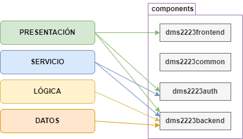

# **PRÁCTICA 01**
En el presente documento se redactará el informe sobre la práctica 01 de la asignatura de Diseño y mantenimiento del software.

## Alumnos
El grupo de alumnos que realizará la práctica está compuesto por:
* Guillermo Arcal García (gag1005@alu.ubu.es)
* Gonzalo Burgos de la Hera (gbd1004@alu.ubu.es)
* Santiago Díaz Gómez-Guillamón (sdg1002@alu.ubu.es)
* Gadea Lucas  Pérez (glp1002@alu.ubu.es)

## Repositorio
El _fork_ del repoositorio usado por los alumnos es el siguiente:  https://github.com/gbd1004/practica-dms-2022-2023.

___


## Memoria
A continuación se explicarán las decisiones de diseño tomadas a lo largo de la práctica con su justificación correspondiente.

## Tabla de contenido
1. [Arquitectura escogida](# "Arquitectura escogida")
2. [Diseño Frontend](# "Diseño Frontend")
3. [Diseño de Backend](# "Diseño Backend")
4. [Sobre Auth](# "Sobre Auth")
5. [Patrones de diseño](# "Patrones de diseño") 
    5.1. [Patron Fachada](## "Patrón Fachada")
6. [Decisiones de diseño](# "Decisiones de diseño")
    6.1. [Base de datos](## "Base de datos")
7. [De cara a la siguiente entrega](# "De cara a la siguiente entrega")
8. [Bibliografía](#Bibliografía)

### Arquitectura escogida
Recordemos que definir la arquitectura de un sistema consiste en establacer qué componentes forman parte de dicho sistema, qué responsabilidades tienen y las relaciones de dependencia y de uso que hay entre ellos. En este caso, se usará una arquitectura multicapa (i.e. se separan los componentes en distintas capas físicas). Estas capas están formadas por distintos subsistemas y están organizadas jerárquicamente siguiendo una dependencia siempre hacia capas inferiores. En otras palabras, una capa dependerá exclusivamente de las capas inferiores. Esta encapsulación permite la reutilización del código y permite mentener el principio DRY (_"Don't repeat yourself "_).

Así pues, para la estructura general de esta API, se ha mantenido la estructura de cuatro capas propuesta en el repositorio original, que corresponde con la arquitectura <span style="color:yellow">**Clean arquitechture**</span>. A saber, las cuatro capas son las siguientes: 
1. **Capa de presentación:** Se encarga de soportar las distintas interacciones de los usuarios con las funcionalidades que se implementan en la capa de lógica de la API. En esta capa, en conclusión, se muestra al usuario los elementos visuales y formularios. Esta capa no realiza cálculos, ya que su función es separar toda la programación web del resto de la aplicación.
2. **Capa de lógica:** También conocida como capa de negocio. Se encarga de implementar las funcionalidades mencionadas en la capa anterior, que se encargan de aplicar las reglas de negocio y del manejo de los datos con los que el usuario interacciona.
3. **Capa de servicio:** Se trata de una capa intermedia que consiste fundamentalmente en una **fachada**. De esta forma se logra desacoplar la interfaz de usuario del resto de subsistemas. La decisión de utilizar una arquitectura de cuatro capas frente a una de tres capas recae en esta capa de servicio, que nos permite evitar el inminente acoplamiento de una arquitectura con menos capas.
4. **Capa de datos:** Esta es la capa inferior y el núcleo de la arquitectura. Se encarga de recuperar, almacenar y borrar (ocultar en nuestro caso) los datos de la aplicación.


En términos generales, las distintas capas corresponden a los siguientes paquetes:




### Diseño Frontend
[ ] TO DO

Para futuras modificaciones, se propone reutilizar el código de los ficheros HTML de _macros_.
Para poder extender más fácilmente el código (principio SOLID __Open/Closed__) se haría uso del polimorfismo (herencia). Así pues, se crearía un fichero ```lists.html``` que funcionaría como una interfaz común de la que heredarían los subelementos ```list_questions.html```, ```list_answer.html```, ```list_comments.html```, etc... Se deberá tener en cuenta el principio ___Liskov's substitution___ de forma que se pueda sustituir una instancia de ```lists.html``` por una instancia de uno de los subelementos sin modificar el comportamiento del programa. De esta forma lograríamos reducir el fuerte acoplamiento actual y garantizaríamos que todas estas listas estén abiertas a su extensión (pero no a su modificación).


### Diseño Backend
Aunque por lo general el _backend_ suele tener tres capas (i.e.: servicio, negocio y datos), en ocasiones se incluye una capa superior de presentación, como se ha hecho en este caso. La razón de esta decisión recae en la naturaleza de la aplicación, i.e. una API REST. Así pues, en esta capa se incluyen los controladores REST.

Así pues en la capa de _backend_ se pueden distinguir las siguientes capas:
1. Capa de presentación: En la capa de presentación se encuentran aquellos métodos enfocados a que las acciones de los usuarios interactuen con el backend. Estos métodos se ejecutan en el servidor. Actualmente en esta capa también es encuentra la base de datos temporal que utilizamos en cambio de la definitiva ya que esa se hará durante la segunda entrega junto con el resto del backend.
2. Capa de datos:  Actualmente esta capa no está implementada, ya que esto corresponde a una siguiente entrega.
3. Capa de lógica: En la capa lógica, por lo general, se incluyen aquellas operaciones que permiten que los sitios web realicen operaciones en función de las acciones de los usuarios sobre los elementos de la página. Todo esto se ejecuta en los servidores aportando entradas y generando salidas. Puesto que estas funcionalidades no son parte de esta entrega inicial, no se ha implementado nada aún en esta capa.
4. Capa de servicio: [ ] TO DO

### Sobre Auth
La autenticación en el servidor implementada está basada en _tokens_. En palabras simples, se envía al servidor un _token_ "firmado" en cada una de las _requests_. Este _token_ se obtiene tras realizar el login (introduciendo un usuario y constraseña correctos). 

En resumidas cuentas, el flujo de datos para la autentificación es el siguiente:
* De forma transparente, el consumidor pide un token al proveedor.
* El consumidor redirige al usuario a una página segura pasándo el token de usuario como parámetro.
* El usuario se autentica validando el _token_.
* El proveedor envía al usuario de vuelta a la página del consumidor (esta vez con su identidad).


### Patrones de diseño
#### Patrón fachada
Para poder acceder al _backend_ desde el _frontend_, se hace uso de la clase ```backendservice``` que hace la función de fachada. Así pues, el subsistema (_backend_) no tiene conociemiento de la facahada, pero no ocurre lo mismo al contrario. Para ejemplificar esto se ha diseñado un diagrama.


### Decisiones de diseño
#### Base de datos
Para esta primera entrega, en la que solo se precisa desarrollar el _frontend_ de la API, de ha decidido implementar una "BBDD" temporal implementando diccionarios a modo de JSONs. Llegados a este punto la cuestión es, ¿dónde implementarlo? Originalmente, se generaron clases de Python en el componente ```dms2223common``` que incluían los diccionarios mencionados y que, además, eran accesibles desde el _frontend_ directamente. Sin embargo, dado que posteriormente se deberá completar el _backend_, se ha decidido trasladar esas clases a la capa de presentación del _backend_ (```dms2223backend```). De esta forma, nos ahorramos el esfuerzo que supondría modificar el proyecto cuando la cantidad de código relaccionado con estas clases aumente.

### De cara a la siguiente entrega
A lo largo de esta práctica se han implementado tan solo los métodos GET, ya que solo se pretende completar el _frontend_ de la API. Como consecuencia, hay algunos botones y fromularios, así como otros elementos web que, aunque están presentes, no realizan ninguna acción. Los métodos POST serán implementados en la segunda entrega, ya que están estrechamente ligados a la implementación del _backend_. 

Por otra parte, se ha concedido menor importancia al aspecto de la página, puesto que se ha priorizado la funcionalidad de la misma. Por lo tanto, se propone como requisito extra para la siguiente entrega, implementar mejoras de estilo para las páginas web.


## BIBLIOGRAFÍA

title: "Capas, cebollas y colmenas: arquitecturas en el backend."
author: "Cabrera, A.A."
date: "2019"
link: https://www.adictosaltrabajo.com/2019/07/02/capas-cebollas-y-colmenas-arquitecturas-en-el-backend/

title: "Arquitectura de una API REST. Desarrollo de aplicaciones web."
author: "juanda.gitbooks"
date: (n.d.)
link: https://juanda.gitbooks.io/webapps/content/api/arquitectura-api-rest.html.


